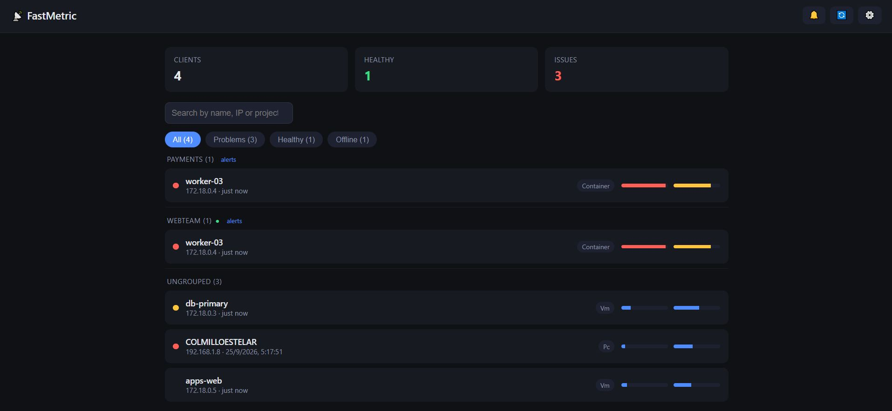
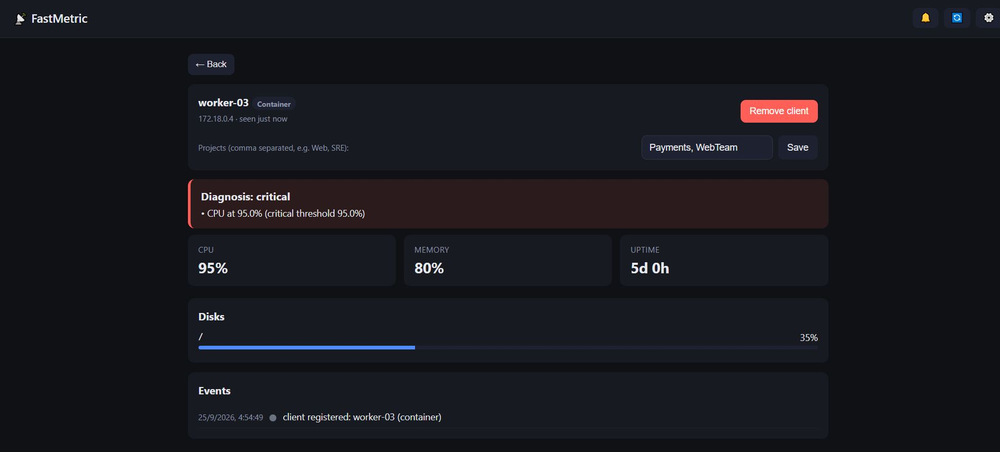
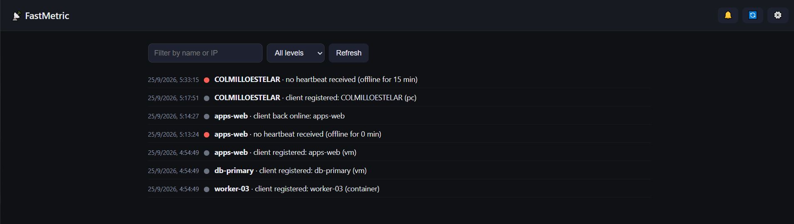
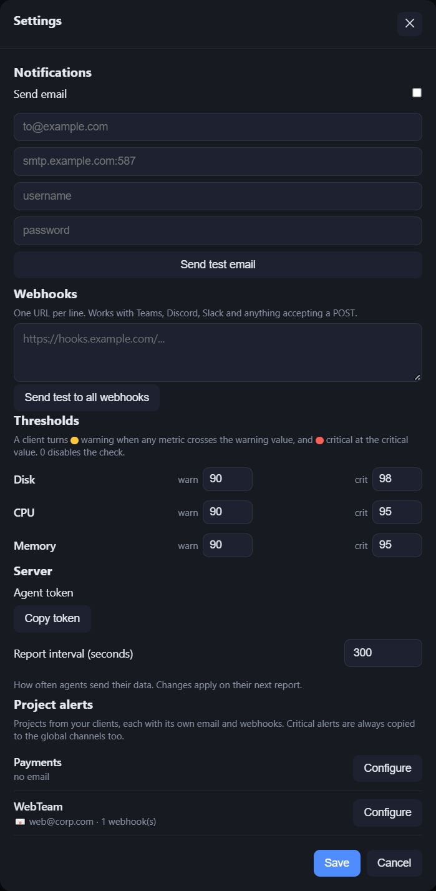

# FastMetric

## See your machines are alive without any drama

FastMetric is a small, self hosted monitoring tool. A tiny agent on each machine sends CPU, memory, disk and uptime to a simple server. The server keeps everything in one SQLite file and shows it in a web dashboard. No Kubernetes, no external database, no complex setup. One server process, one small agent script per machine, and you are done.

It was built for startups and small teams that are just getting started. You do not need a monitoring expert or a big infrastructure. If you can run a Python file and open a browser, you can use FastMetric.

It runs next to Grafana, not instead of it. Grafana is great for deep dashboards. FastMetric answers a simpler question: is my machine OK right now?

---

## How it works

Each machine runs a tiny agent. The agent connects to the server, sends a report, and waits. The server never connects to the machines. This means you do not need open inbound ports or SSH to reach your agents. The connection always goes one way, from machine to server.

```
+--------------------+    agent reports by POST    +---------------------+
| Machine 1 (agent)  |  ----------------------->  |                     |
+--------------------+                            |  FastMetric server  |
+--------------------+    agent reports by POST    |  SQLite + Web UI    |
| Machine 2 (agent)  |  ----------------------->  |  port 8456          |
+--------------------+                            +---------------------+
+--------------------+    agent reports by POST             |
| Machine 3 (agent)  |  ----------------------->            v
+--------------------+                        alerts only on change
                                              (sound, email, webhook)
```

The arrow points only one way: from agent to server. Agents open the connection, the server just listens. This is ideal for machines inside a company network that have no public address, like databases, laptops and VMs.

---

## Try it now in Docker (3 minutes)

The repo includes a demo that starts everything with one command. It spins up the server plus three simulated machines: one healthy, one with a nearly full disk, one with high CPU and memory. Perfect to see the tool working before you touch your real machines.

```
docker compose up --build
```

Then open your browser at http://localhost:8456

You will see three simulated clients with their status, CPU and memory bars. Click one to open the detail view with diagnostics, history, disks, events and a remove button. Open the log and the settings to explore the alert options.

To stop the demo and clear all demo data:

```
docker compose down -v
```

### What the dashboard looks like









---

## Use it with your real machines (VMs, PCs, containers)

Testing with docker is only the first step. To monitor real machines you run the server once and then install the agent on each machine.

### Step 1. Start the server

Copy the project to a machine that is always on, like a small VM or an old laptop. Install the requirements and run:

```
pip install -r requirements.txt
python run.py
```

The server starts on port 8456 and shows the dashboard in your browser. Everything is stored in one SQLite file, so there is nothing else to configure for a quick start.

### Step 2. Get the shared token

Open the server web page in your browser and go to Settings. Copy the token shown there. Every agent uses the same token to report to the server. It is like a password shared between your machines.

### Step 3. Install the agent on each machine

Copy the agent file `agent/agent.py` to the target machine. It uses only the Python standard library, so there is nothing to install on the target machine. Python is enough.

Then set two environment variables. On Linux:

```
export MS_SERVER_URL=http://your-server:8456
export MS_TOKEN=your-token-from-settings
python3 agent.py
```

On Windows PowerShell:

```
$env:MS_SERVER_URL="http://your-server:8456"
$env:MS_TOKEN="your-token-from-settings"
python agent.py
```

The same steps work for a database, a laptop or a VM. The agent is the same tiny file everywhere.

---

## Keep the agent always connected

The agent only reports while it is running. To keep a machine connected you must schedule the agent so the system starts it and keeps it alive. Forgetting this is the most common mistake, so here are the ready to use commands.

### Linux: cron, every 5 minutes

The agent has a `--once` mode: it reports a single time and exits, and cron runs it again a few minutes later Mend(n)prove.

```
chmod +x agent/agent.py
crontab -e
```

Add this line, changing the path and the server URL:

```
*/5 * * * * cd /path/to/fastmetric && MS_SERVER_URL=http://your-server:8456 MS_TOKEN=your-token python3 agent/agent.py --once
```

### Linux: systemd, always on

If you prefer the agent to run forever without cron, create a service file at `/etc/systemd/system/fastmetric-agent.service`:

```
[Unit]
Description=FastMetric agent
After=network.target

[Service]
ExecStart=/usr/bin/python3 /path/to/fastmetric/agent/agent.py
Environment=MS_SERVER_URL=http://your-server:8456
Environment=MS_TOKEN=your-token
Restart=always

[Install]
WantedBy=multi-user.target
```

Then enable it:

```
sudo systemctl enable --now fastmetric-agent
```

### Windows: Task Scheduler

```
schtasks /Create /TN "FastMetricAgent" /TR "python C:\fastmetric\agent\agent.py --once" /SC MINUTE /MO 5 /F
```

This creates a task that runs the agent every 5 minutes. The agent reports, exits, and the task runs it again. The machine stays visible in the dashboard even after a reboot, because the task is registered in the system scheduler.

Open the Task Scheduler, find the `FastMetricAgent` taskaisle, and make sure "Run whether user is logged on or not" is checked so it keeps running in the background.

---

## Settings are owned by one admin

FastMetric has settings that change how the whole tool behaves: the shared agent token, alert thresholds, alert sound, SMTP email, webhooks and the report interval. If every person changes these on their own, the tool becomes chaos. Tokens stop matching, alerts go to the wrong places, thresholds start conflicting.

That is why FastMetric is designed for a single owner. One admin, or one person who is in charge, manages all the settings from the Settings screen. That person:

- gets the shared token and gives it to the machines
- sets the alert thresholds once
- configures SMTP email and webhooks once
- turns the alert sound on or off for the whole team

Everyone else just looks at the dashboard情緒(page). They see the status, open the diagnostics)Skip and read the log, but they do not change the settings. This keeps the tool calm and predictable. Pick one person to be the admin and make sure only that person has the Settings credentials.

---

## Diagnostics

Every report is checked against rules. When a machine changes state, an event is recorded and, if configured, an alert is sent once. Alerts fire only on state transitions, never on every report.

| Metric | Warning | Critical |
|---|---|---|
| Disk | 90% or more | 98% or more |
| CPU | 90% or more | not set |
| Memory | 90% or more | not set |

Thresholds live in `server/diagnostics.py` and are easy to tune.

---

## What the agent reports

- CPU percent
- Memory percent
- Per disk: mount, total, used, percent
- Uptime in seconds
- Hostname, detected IP, kind (pc, vm or container)

---

## Web UI

- Dashboard: all clients, status dots, search and filter chips, CPU and memory bars, grouped by project
- Client detail: diagnosis with evidence, metrics, disks, event history, remove button
- Log: full event history, searchable and filterable by level
- Settings: alert sound, optional SMTP email, webhooks, agent token, report interval

---

## Project layout

```
agent/      the agent, pure Python standard library
server/     FastAPI server, SQLite storage, diagnostics
web/        single page UI, no build step
docs/       screenshots and extra docs
docker-compose.yml   demo with server plus 3 simulated agents
```

---

## Extend it

- New checks: add rules in `server/diagnostics.py`
- More metrics: extend the payload in `agent/agent.py`
- New notification targets: add a transport in `server/notify.py`

---

## Notes

- HTTP is plain in the default setup, for use inside a trusted network. Add TLS with a reverse proxy when exposing it further.
- Data is stored in one SQLite file. No external database needed.

---

## License

Apache 2.0
